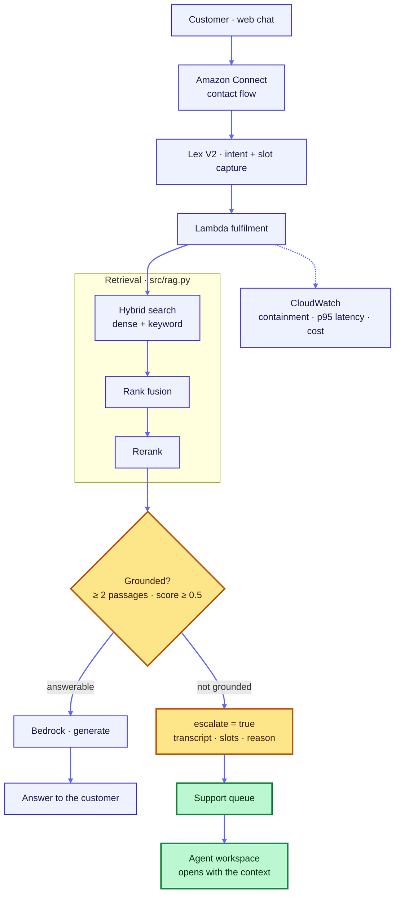

# Amazon Connect → Lex → grounded RAG

[](https://github.com/sadvi11/amazon-connect-rag-agent/actions/workflows/ci.yml)
[](#how-this-is-tested)
[](#cost)

A contact centre chat bot that answers from a knowledge base, **refuses rather
than guesses**, and hands to a human with the conversation attached.

Containment, per-turn latency and cost per contact are instrumented, because a
contact centre is managed on those three numbers and a demo that cannot report
them has not addressed the problem.

**Nothing is deployed.** Every test runs offline. See [Cost](#cost).

---

## Architecture



The decision point is **Grounded?**. Everything else is plumbing.

Rendered in both light and dark before committing — a mermaid block that
parses is not the same as a diagram anyone can read.

---

## The one idea

**Abstention is enforced in code, not requested in a prompt.**

The expensive failure in a contact centre is not "I don't know" — customers
accept that. It is a confident wrong answer about a refund or a deadline,
delivered in the brand's voice. A model *told* to be careful can be talked out
of it by a persistent customer. A function that returns early cannot.

So [`src/rag.py`](src/rag.py) refuses before generation runs, on two gates:

| Gate | Refuses when | Why |
|---|---|---|
| `MIN_PASSAGES = 2` | fewer than two passages retrieved | one hit can be a coincidence of wording |
| `MIN_RELEVANCE = 0.5` | best match scores below the threshold | retrieved ≠ relevant |

And once more **after** generation: if the model declines despite adequate
context, that is an abstention, not an answer — so containment does not count
it as a success.

Generation does not run when we are going to refuse. Checking afterwards means
paying for a call we discard, and leaves an unusable answer sitting in the
process where somebody may later be tempted to return it.

---

## The pipeline, module by module

| | What it does | Why it is not the obvious thing |
|---|---|---|
| [`chunking.py`](src/chunking.py) | Splits on structure, overlaps by whole sentences, carries the heading into the chunk | Retrieval cannot return a passage chunking never produced. Splitting every 500 characters cuts mid-sentence, so the embedding is a blend of two half-thoughts and matches neither |
| [`rag.py`](src/rag.py) | Hybrid search → rank fusion → rerank → two abstention gates | `retrieve_async` runs the two searches concurrently, so the cost is the slower of them rather than the sum |
| [`prompts.py`](src/prompts.py) | Packs context to a token budget, strongest passage first and second-strongest last | More context is not better context. Past a point the relevant passage is diluted by three that merely share vocabulary |
| [`schemas.py`](src/schemas.py) | Pydantic request/response contracts | A validator refuses to construct an ungrounded answer that does not escalate — the failure mode where a customer is told "I don't know" and left in a loop |
| [`service.py`](src/service.py) | FastAPI, `/ask` `/health` `/metrics` | Every response carries its own latency, cost and token usage, with a request id echoed back for correlation |
| [`fulfillment.py`](src/fulfillment.py) | The Lambda Lex calls | |
| [`handoff.py`](src/handoff.py) | Builds the agent briefing | |
| [`metrics.py`](src/metrics.py) | Containment, p95, cost per contact | |

```bash
uvicorn src.service:app --reload
```

### Two decisions worth arguing about

**Context ordering.** Models attend most reliably to the beginning and end of
their input, so `pack_context` puts the strongest passage first and the
**second**-strongest last, weaker ones in the middle. Sorting by score
descending — the obvious thing — buries the second-best passage in the weakest
position in the window. It costs nothing to fix.

**The token estimate is deliberately not a tokeniser.** It only has to decide
whether one more passage fits, and being wrong in the safe direction costs a
passage rather than a failed request. A real tokeniser is a model-specific
dependency for a budgeting decision that tolerates 15% error. Actual usage is
reported by the model, not estimated.

---

## Retrieval

Dense search alone reliably misses exactly what a contact centre is asked
about: order numbers, policy codes, SKUs, the literal phrase "30 days".
Embeddings map those to whatever they sit near in vector space, which is not
the same as matching them. Keyword search alone misses paraphrase, which is how
customers write.

So both, fused by **Reciprocal Rank Fusion**, then **reranked**.

RRF combines by *position*, not score. Dense similarity and keyword relevance
are not on the same scale and there is no honest way to add them; using rank
sidesteps the normalisation fudge entirely.

Reranking runs on the shortlist only. Retrieval optimises for recall — get the
right passage into the top twenty. Reranking optimises for precision — get it
to position one. Over the whole corpus that would be unaffordable; over twenty
candidates it is cheap, and it is where most of the quality comes from.

> **What the reranker here is not.** It scores term overlap so the tests stay
> offline and free. That measures vocabulary, not meaning — and
> [`tests/test_threshold.py`](tests/test_threshold.py) keeps a **failing test**
> for a case it gets wrong: *"What policy covers salary disputes?"* scores at
> the threshold because "policy" matches, though the corpus says nothing about
> salaries. It is marked `xfail` rather than deleted, because curating it out
> of the eval set would hide the ceiling. The fix is a cross-encoder in
> `rerank()` — a different body behind the same interface — not a higher
> threshold, which would start refusing real questions.

---

## Handoff

The reason people hate chatbots is not that the bot failed. It is being asked to
repeat everything to the human afterwards, which says the first five minutes
were wasted and hands the agent a cold start.

[`src/handoff.py`](src/handoff.py) puts the recent transcript, the captured
slots, the reason for the handoff, and a one-line agent briefing into Connect
contact attributes, so the agent opens with the right thing instead of *"how
can I help?"*

Attribute values are clipped, because Connect rejects the **entire**
`SetContactAttributes` call if one value is too long — at runtime, mid
conversation, not at deploy.

---

## The metrics

Containment is the number a contact centre is managed on, and the easiest to
game. A bot that answers everything confidently reports 100% containment while
quietly making customers angry.

So a contact counts as contained only if it ended **without escalation** *and*
**every answer was grounded**. Both halves are load-bearing, and
[`tests/test_metrics.py`](tests/test_metrics.py) asserts a confidently wrong
bot scores zero.

An abstention is deliberately **not** counted as containment. Refusing
correctly is right behaviour, but it is not a resolved contact — and a metric
that pretends otherwise hides the knowledge-base gap that caused it.

Latency is reported at p50 and **p95, never as a mean**. A mean hides the tail,
and the tail is what the customer waiting on the chat window experiences.

Run it:

```bash
python demo.py
```

```json
{
  "contacts": 5,
  "turns": 7,
  "containment_rate": 0.2,
  "escalation_rate": 0.8,
  "cost_per_contact_usd": 0.03396
}
```

That containment number is low **on purpose** — the demo set is four hard cases
and one easy one, chosen to exercise the gates rather than to flatter the bot.
A realistic traffic mix would look nothing like it, and a demo tuned to produce
a good number would be measuring the demo, not the design.

---

## How this is tested

**91 tests, no AWS account, no model, no network.** The store and generator are
substituted; everything between them is the code that runs in Lambda.

The concurrency test measures **wall-clock time**, because a `gather()` over
two blocking calls made inline is indistinguishable from running them in
sequence except in how long it takes. Identical results, no concurrency, green
tests.

The Connect flow and Lex bot are JSON, so they are checked as data rather than
by clicking through a console:

- every transition points at an action that exists
- no action is unreachable
- a Lex failure routes to a human rather than looping the customer
- the flow compares `$.Attributes.escalate` — **the exact attribute the Lambda
  sets**. If those two drift apart, escalation silently never happens and
  nothing errors

### The checks are proven able to fail

```console
$ python verify_checks_fail.py
ok    caught: the bot answers weak matches instead of refusing
ok    caught: a model saying 'I don't know' counts as a contained answer
ok    caught: escalation never sets the flag the contact flow branches on
ok    caught: a stale escalate=true persists into a successful turn
ok    caught: a confidently wrong bot reports perfect containment
ok    caught: the flow compares an attribute nothing ever sets
ok    caught: a Lex failure loops the customer instead of finding a human

All 15 defects are caught. The checks are load-bearing.
```

Every one of those failures is **silent**. None raises an exception, and a
green pipeline would report success for all of them.

### Weak tests that fault injection exposed

Three of mine, all of which looked like coverage:

- **A test that passed either way.** `test_the_heading_travels_with_the_chunk`
  asserted `embedding_text.startswith("Refunds")` against a chunk whose body
  already began with "Refunds" — true whether or not the heading was prepended
  at all. The fixture now starts the body with a different word.
- **A validator nothing exercised.** `/ask` derives `escalate` from `grounded`,
  so it can never produce the invalid combination the Pydantic validator
  guards. It was untested while appearing covered. Now tested directly.
- **A safety check tested on one branch of two.** Refactoring created a second
  copy of the model-refusal check in `answer_async`; only the sync path had a
  test. The injected fault landed in the async copy and nothing went red.

### Bugs this found while being built

- **`max()` on an empty sequence** in the relevance gate. Unreachable at
  `MIN_PASSAGES = 2`, but lowering that constant turns a refusal into an
  unhandled exception — in Lambda, a 500 to a customer mid-chat.
- **`escalate` was never set on the success path.** Session attributes persist
  across turns, so a stale `escalate=true` would have routed a perfectly good
  answer to an agent.
- **A comment describing code I had not written.** `_maybe_await` said a
  synchronous store "goes to a thread"; it called it inline, which holds the
  event loop and silently serialises the two searches `gather()` is meant to
  overlap. Tests passed — the results are identical — and the concurrency
  simply did not happen.
- **Chunking merged across section boundaries.** A "Returns" section under the
  minimum chunk size was absorbed into the previous "Refunds" chunk and
  inherited its heading, so it embedded under the wrong topic and was
  unreachable by anyone asking about returns.
- **`MIN_RELEVANCE` was decorative.** An early version of the eval set proved
  the passage-count gate caught everything and the threshold refused nothing —
  while still being cited as a control. The test now checks each gate
  independently.

---

## Cost

**Nothing here has been deployed and nothing has been billed.**

Amazon Connect has no free tier. If you do deploy it, chat-only:

| | Rate | 10-turn chat |
|---|---|---|
| Connect chat | $0.010 / message | ~$0.20 |
| Lex V2 text | $0.004 / request | ~$0.04 |
| Bedrock | ~$0.0003 / query | ~$0.003 |
| Lambda | free at this volume | $0.00 |

**Do not claim a phone number.** A number bills daily whether or not anyone
calls it, which is the one way this becomes a recurring charge instead of a
handful of cents. Chat needs no number.

---

## Deploying it

```bash
# Lex bot and contact flow are importable as-is
aws lexv2-models create-bot --cli-input-json file://lex/bot.json
aws connect create-contact-flow --content file://connect/contact-flow.json \
    --instance-id <id> --name RagChatFlow --type CONTACT_FLOW
```

`connect/contact-flow.json` references `$.Parameters.LexBotAliasArn` and
`$.Parameters.SupportQueueArn`; both are set at import.

---

## Author

**Sadhvi Sharma** — Calgary, Alberta ·
[github.com/sadvi11](https://github.com/sadvi11) ·
[portfolio](https://sadvi11.github.io)

MIT.
